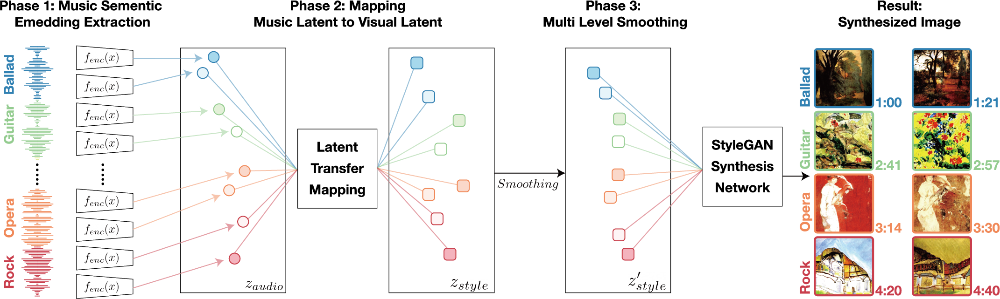

Our goal is to generate a visually appealing video that responds to music with a neural network so that each frame of the video represents the musical characteristics of the corresponding audio clip. To achieve the goal, we propose a neural music visualizer directly mapping deep music embeddings to style embeddings of StyleGAN, named TräumerAI.

Figure.1 System diagram and generated images from Queen's Bohemian Rhapsody

### Generated Videos
Below are the generated results of TräumerAI. The mapping between music and image is manually labeled with 100 pairs. The images are generated by StyleGAN2 pre-trained with WikiArt (https://github.com/pbaylies/stylegan2).

The labeled dataset does not include any music from the artists included in this demo.

## With modified smoothing and higher fps
Luis Fonsi - Despacito 
<iframe width="720" height="720" src="https://www.youtube.com/embed/3AEcQdbQIow" frameborder="0" allow="accelerometer;  clipboard-write; encrypted-media; gyroscope; picture-in-picture" allowfullscreen></iframe>

John Williams - Star Wars Main Title 
<iframe width="720" height="720" src="https://www.youtube.com/embed/er3J7_g8aCE" frameborder="0" allow="accelerometer;  clipboard-write; encrypted-media; gyroscope; picture-in-picture" allowfullscreen></iframe>

Wagner - Ride of Valkyries
<iframe width="720" height="720" src="https://www.youtube.com/embed/Fu89NI6EnuM" frameborder="0" allow="accelerometer;  clipboard-write; encrypted-media; gyroscope; picture-in-picture" allowfullscreen></iframe>

Queen - Bohemian Rhapsody
<iframe width="720" height="720" src="https://www.youtube.com/embed/HY0qIOK42Og" frameborder="0" allow="accelerometer;  clipboard-write; encrypted-media; gyroscope; picture-in-picture" allowfullscreen></iframe>

Queen - Bohemian Rhapsody (PhilharmoniX version)
<iframe width="720" height="720" src="https://www.youtube.com/embed/s0xeWz4sueM" frameborder="0" allow="accelerometer;  clipboard-write; encrypted-media; gyroscope; picture-in-picture" allowfullscreen></iframe>

Schumann - Träumerei
<iframe width="720" height="720" src="https://www.youtube.com/embed/7SFCge5HGtU" frameborder="0" allow="accelerometer;  clipboard-write; encrypted-media; gyroscope; picture-in-picture" allowfullscreen></iframe>

## Old Examples
Schumann - Träumerei 
<iframe width="720" height="720" src="https://www.youtube.com/embed/fmsBeOfMVtA" frameborder="0" allow="accelerometer; autoplay; clipboard-write; encrypted-media; gyroscope; picture-in-picture" allowfullscreen></iframe>

Queen - Bohemian Rhapsody
<iframe width="720" height="720" src="https://www.youtube.com/embed/5QNoaV-zECM" frameborder="0" allow="accelerometer; clipboard-write; encrypted-media; gyroscope; picture-in-picture" allowfullscreen></iframe>

BTS - Dynamite
<iframe width="720" height="720" src="https://www.youtube.com/embed/ggFyf9zXs0U" frameborder="0" allow="accelerometer;  clipboard-write; encrypted-media; gyroscope; picture-in-picture" allowfullscreen></iframe>

Avicii - Waiting for Love
<iframe width="720" height="720" src="https://www.youtube.com/embed/GDZv7mHOTIQ" frameborder="0" allow="accelerometer;  clipboard-write; encrypted-media; gyroscope; picture-in-picture" allowfullscreen></iframe>

Adele - Hello
<iframe src="https://drive.google.com/file/d/1fBfmJqrj8tKpJMvEcfyVIXI-JdposTPB/preview" width="720" height="720"></iframe>

